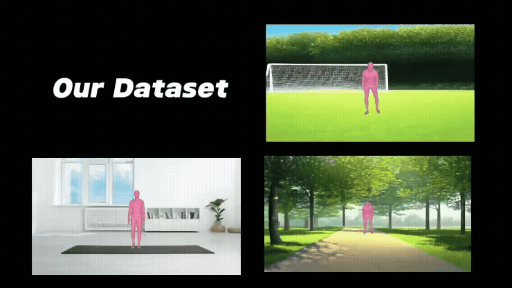

This is a scene-aware human-motion generation project for Master’s class at Bournemouth University (2025).

# Abstract

We introduce a framework that turns a single RGB image + monocular depth into realistic, physically-plausible human motion, skipping text prompts and heavy 3D scene recon. A Transformer-based diffusion model consumes image and depth features to predict full motion sequences, trained on our new image-motion bi-modal dataset. The model beats strong baselines on multiple metrics, proving that lightweight visual input is enough for high-quality scene-aware motion generation.

  
  &nbsp;  <!-- margin-right -->
  

  
  &nbsp;
  

# Environment Configuration

Our code was developed and tested on **Python 3.11.12** (Colab, Ubuntu 22.04) with
CUDA-enabled PyTorch.

| Core stack | Version we used | Notes |
|------------|-----------------|-------|
| Python | 3.11 (≥ 3.9 works) | tested 3.11.12 |
| PyTorch | 2.2.\* | install the wheel that matches your CUDA (11.8 on Colab) |
| CUDA | 11.8 | CPU also works, just slower |

# How to run

You can either **git&nbsp;clone** the repository and run the code locally **or** open it in **Google Colab** and mount  
[this Google Drive folder](https://drive.google.com/drive/folders/16Q5ZxyF2KachxZsyp_Vr8JTcgr-5m0Kr?usp=sharing).

> _Note:_ The full dataset and generated checkpoints are too large to store on GitHub; the Drive folder contains the complete set of files.
